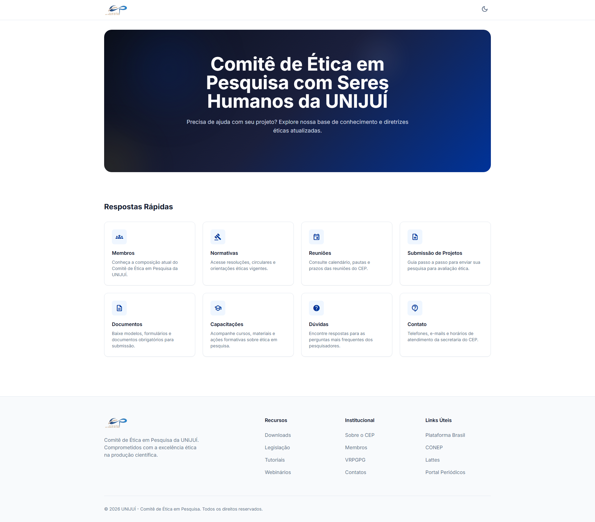
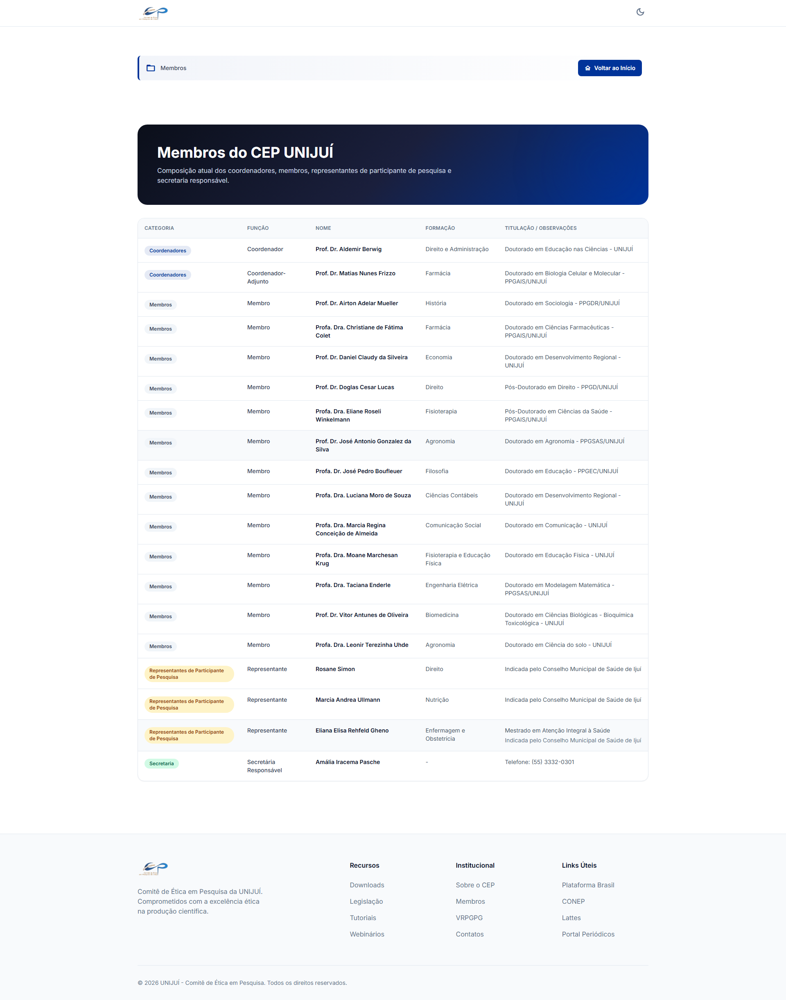
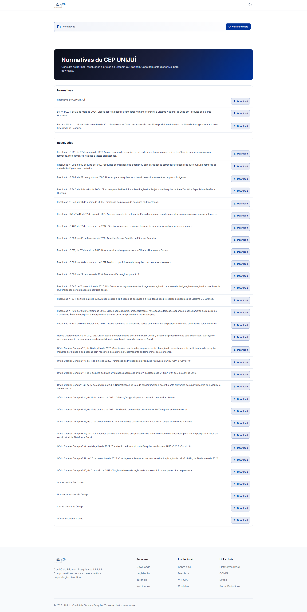
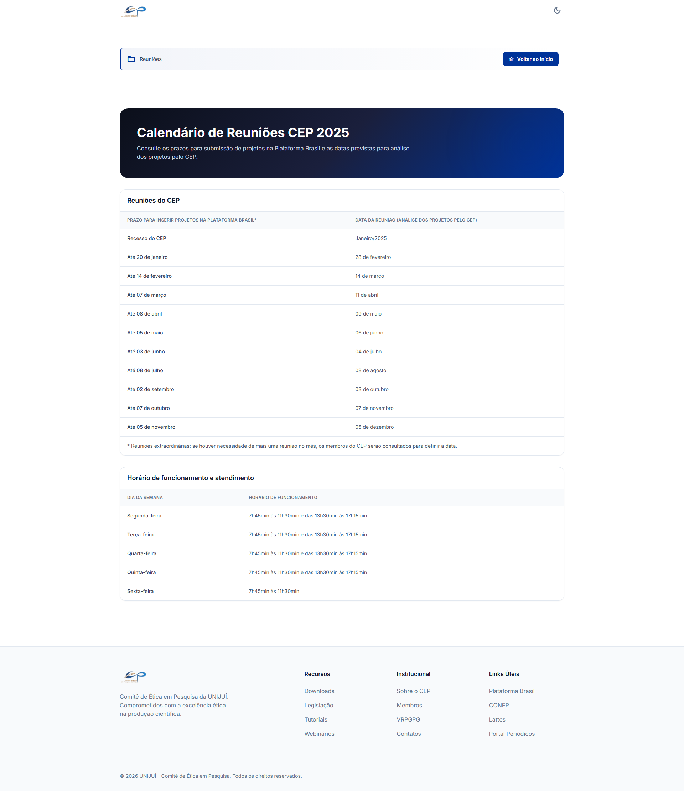
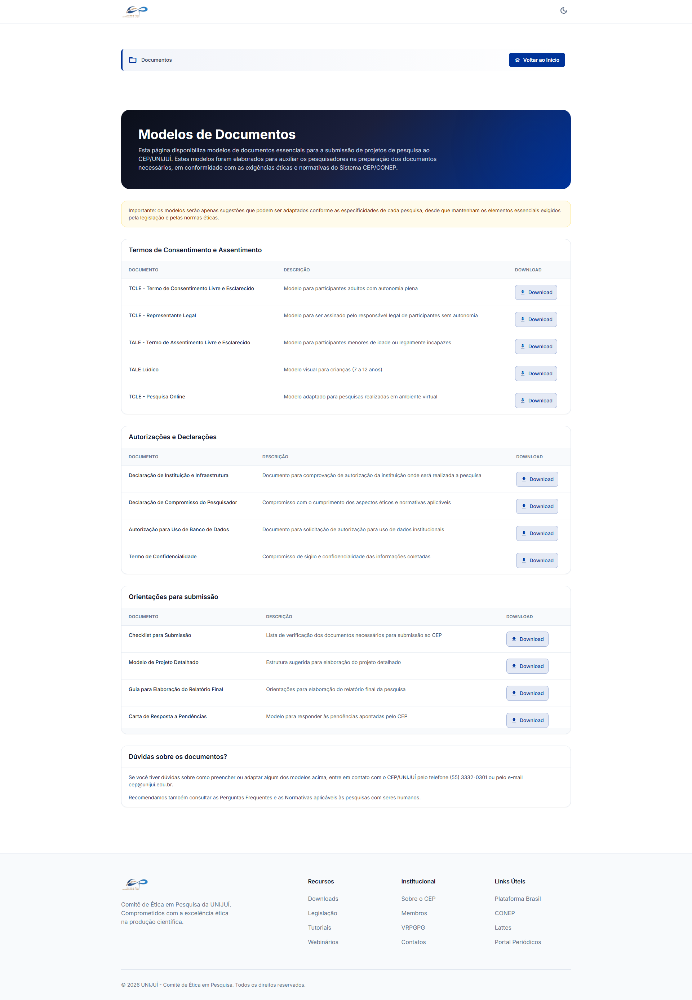
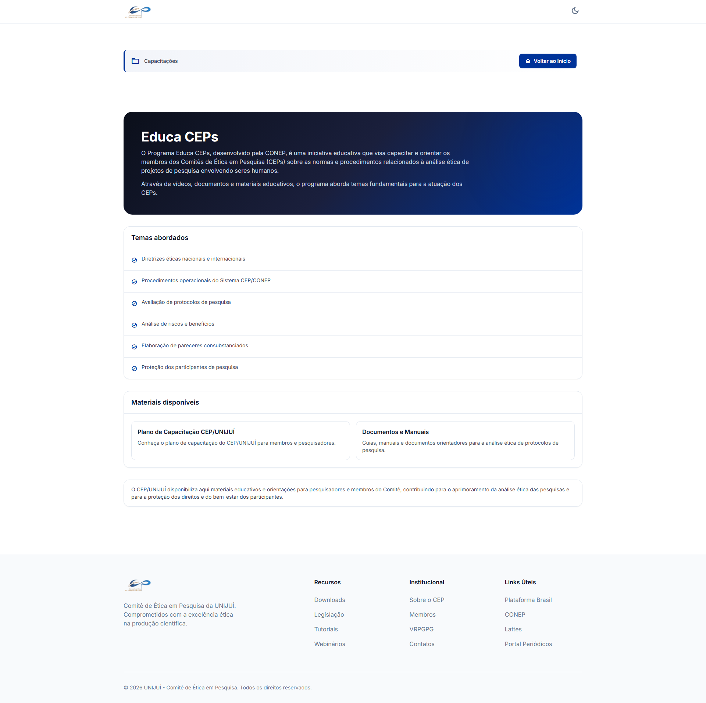
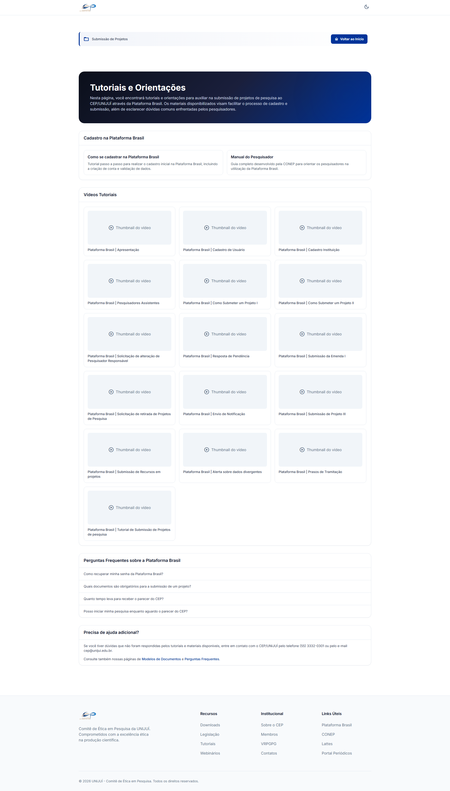
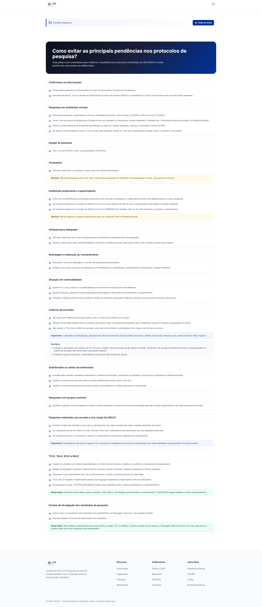
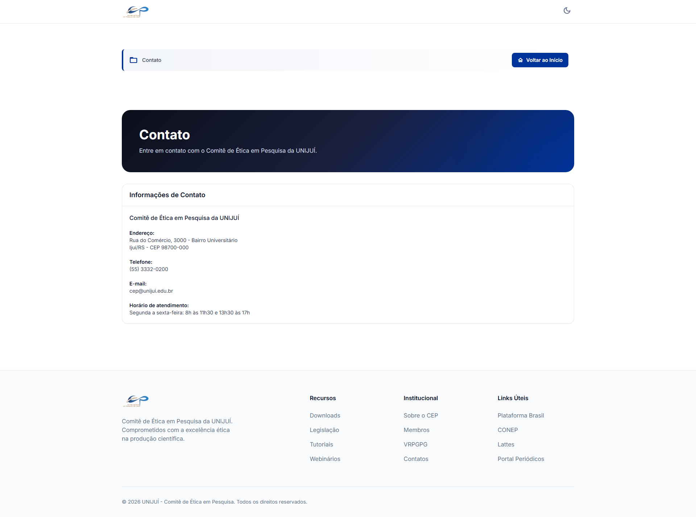

# CEP UNIJUÍ — Research Ethics Committee Website

Official website of the **Research Ethics Committee (CEP)** of UNIJUÍ (Universidade Regional do Noroeste do Estado do Rio Grande do Sul). Built with React, TypeScript, Vite, and Tailwind CSS, the application provides researchers and the general public with easy access to members, normatives, meeting schedules, document templates, training materials, and submission guidelines.

---

## Screenshots

### Home


### Members


### Normatives


### Meetings Calendar


### Documents


### Capacitations (Educa CEPs)


### Project Submission


### Common Questions / Avoiding Pending Issues


### Contact


---

## Tech Stack

| Technology | Version | Purpose |
|---|---|---|
| [React](https://react.dev/) | 19 | UI library |
| [TypeScript](https://www.typescriptlang.org/) | ~5.9 | Type safety |
| [Vite](https://vitejs.dev/) | 6 | Build tool & dev server |
| [Tailwind CSS](https://tailwindcss.com/) | 3.4 | Utility-first styling |
| [React Router DOM](https://reactrouter.com/) | 7 | Client-side routing |
| [PostCSS](https://postcss.org/) | 8 | CSS processing |

---

## Pages & Routes

| Route | Page | Description |
|---|---|---|
| `/` | Home | Hero section + quick-access cards |
| `/membros` | Members | Table of all CEP members by category |
| `/normativas` | Normatives | Grouped sections of resolutions, circulars and normatives with file download |
| `/reunioes` | Meetings | Annual meeting calendar and service hours |
| `/documentos` | Documents | Document templates grouped by category |
| `/capacitacoes` | Capacitations | Educa CEPs program topics and materials |
| `/submissao-projetos` | Project Submission | Tutorials, video guides and FAQs for Plataforma Brasil |
| `/duvidas` | Common Questions | Practical guide to avoid recurring pending issues |
| `/contato` | Contact | Address, phone, email and service hours |

---

## Project Structure

```
cep-unijui/
├── public/
│   └── normatives/          # Static normative text files (item-001.txt … item-034.txt)
├── src/
│   ├── assets/              # Static assets (images, icons)
│   ├── components/
│   │   ├── BackButton.tsx   # Back navigation button
│   │   ├── Footer.tsx       # Global footer
│   │   ├── Header.tsx       # Global header with navigation and dark mode toggle
│   │   ├── HeroSection.tsx  # Home hero banner
│   │   └── QuickAnswersSection.tsx  # Home quick-access card grid
│   ├── pages/
│   │   ├── CapacitacoesPage.tsx
│   │   ├── ContatoPage.tsx
│   │   ├── DocumentosPage.tsx
│   │   ├── DuvidasPage.tsx
│   │   ├── MembersPage.tsx
│   │   ├── NormativasPage.tsx
│   │   ├── ReunioesPage.tsx
│   │   └── SubmissaoProjetosPage.tsx
│   ├── App.tsx              # Root component, routes and scroll-to-top logic
│   ├── App.css
│   ├── index.css            # Global styles + Tailwind directives
│   └── main.tsx             # Application entry point
├── README-img/              # Screenshots used in this README
├── index.html
├── package.json
├── tailwind.config.js
├── tsconfig.json
├── tsconfig.app.json
├── tsconfig.node.json
├── vite.config.ts
└── eslint.config.js
```

---

## Design System

| Token | Value |
|---|---|
| Primary color | `#003399` (UNIJUÍ blue) |
| Secondary color | `#FFCC00` (UNIJUÍ yellow) |
| Background (light) | `#FFFFFF` |
| Background (dark) | `#0B0F1A` |
| Font | Inter (display + body) |
| Border radius default | `12px` |

Dark mode is toggled via the `dark` class on the `<html>` element (Tailwind `darkMode: 'class'`).

---

## Features

- **Fully responsive** layout for mobile, tablet, and desktop
- **Dark mode** support with smooth transitions
- **Lazy-loaded pages** via `React.lazy` + `Suspense` for optimal performance
- **Scroll-to-top** on every route change, with anchor-hash support
- **Code splitting** configured in Vite with manual chunks for React and React Router
- **Static normative files** served from the `public/` directory

---

## Getting Started

### Prerequisites

- [Node.js](https://nodejs.org/) 18+
- [npm](https://www.npmjs.com/) 9+ (or compatible package manager)

### Installation

```bash
# Clone the repository
git clone https://github.com/your-org/cep-unijui.git
cd cep-unijui

# Install dependencies
npm install
```

### Development

```bash
npm run dev
```

The app will be available at `http://localhost:5173`.

### Build

```bash
npm run build
```

Output is generated in the `dist/` folder.

### Preview production build

```bash
npm run preview
```

### Lint

```bash
npm run lint
```

---

## Backend Integration (planned)

The application currently uses static data. A Laravel REST API backend is planned to make all content dynamic. The full backend specification — including all models, migrations, endpoints, and upload rules — is documented in [`BACKEND_SPEC.md`](BACKEND_SPEC.md).

---

## License

This project is maintained by UNIJUÍ. All rights reserved.
